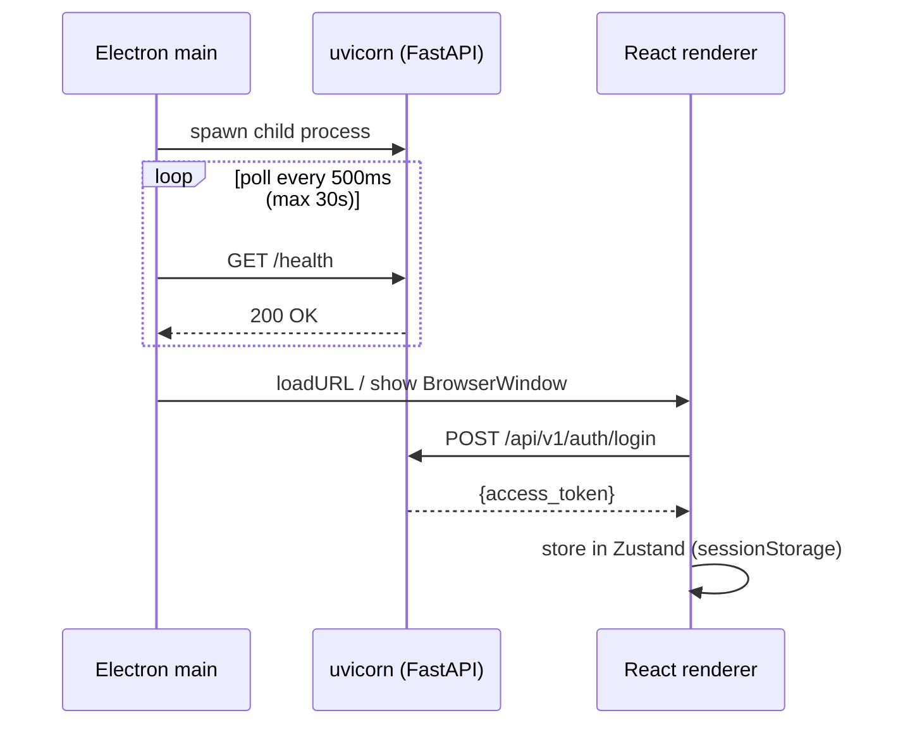

# Architecture

## System Components

Agon is a **local-first, single-machine** application. All data lives on the studio manager's machine.

```
┌─────────────────────────────────────────────────────┐
│  Studio Manager's Machine                           │
│                                                     │
│  ┌──────────────────────┐   ┌────────────────────┐  │
│  │  Electron (main)     │   │  FastAPI (backend) │  │
│  │  - spawn uvicorn     │──▶│  - REST API        │  │
│  │  - poll /health      │   │  - APScheduler     │  │
│  │  - show window       │   │  - SQLite (WAL)    │  │
│  └──────────────────────┘   └────────────────────┘  │
│            │                         │               │
│            ▼                         ▼               │
│  ┌──────────────────────┐   ┌────────────────────┐  │
│  │  React (renderer)    │   │  SQLite DB file    │  │
│  │  - Zustand (auth)    │   │  (WAL mode, FK ON) │  │
│  │  - React Query       │   └────────────────────┘  │
│  └──────────────────────┘                            │
│                                                     │
│  ┌──────────────────────┐                            │
│  │  Cloudflare Tunnel   │◀── clients' mobile apps   │
│  │  (optional)          │                            │
│  └──────────────────────┘                            │
└─────────────────────────────────────────────────────┘
```

## Startup Sequence



If uvicorn does not respond within 30 seconds, Electron shows an error dialog and exits.

## Transaction Semantics

**Rule**: `db.commit()` belongs in the **router layer only**. Service functions (`app/services/`) receive a `Session`, perform all operations, and return — they never commit. The router commits once after all operations succeed.

```python
# router
def create_booking(payload, db, token):
    booking = booking_service.create(db, payload, user_id)   # no commit inside
    notification_service.queue_confirmation(db, booking.id)  # no commit inside
    db.commit()                                               # single commit here
    return booking
```

This means if the notification queue write fails, the booking is also rolled back — no partial state.

## Error Response Format

All 4xx and 5xx responses use:

```json
{
  "error": {
    "code": "BOOKING_CLASS_FULL",
    "message": "This class is full.",
    "details": { "waitlist_available": true }
  }
}
```

Use `raise_api_error(code, message, status_code, details=None)` from `app.utils` for all error responses.

## Background Task Lifecycle

APScheduler tasks run inside the same FastAPI process (same SQLite connection pool). Each task:
1. Opens its own `Session` via `SessionLocal()`
2. Catches all exceptions and logs them — never propagates
3. Closes its session in a `finally` block

If a task fails it is logged and the next scheduled run will retry. There is no dead-letter queue.

## Database Patterns

### UTC-naive datetimes
All `DateTime` columns store UTC-naive values. Always compare with `utcnow()` from `app.utils`:

```python
from app.utils import utcnow
db.query(Booking).filter(Booking.created_at >= utcnow() - timedelta(days=7))
```

Never use `datetime.utcnow()` (deprecated since Python 3.12) or timezone-aware datetimes for DB comparisons.

### location_id convention
Every business entity has `location_id = Column(Integer, nullable=False, default=1)`. Location 1 (`Main Studio`) is seeded at first migration and acts as the default for V1. V2 multi-location support will filter on this column.

### WAL mode
SQLite runs in WAL (Write-Ahead Logging) mode with `synchronous=NORMAL`. This reduces read/write lock contention between the background task scheduler and the API layer. Enabled in `database.py` via `event.listens_for(engine, "connect")`.

---

## Delete and Soft-Delete Strategy

### Cascade hard delete

| Parent deleted | Children affected |
|---|---|
| `class_templates` | `scheduled_classes` — **blocked** if future classes exist; past classes are orphaned (template_id left in place, historical data preserved) |
| `scheduled_classes` (cancelled) | `bookings` → status set to `cancelled`, credits refunded via cancellation logic |
| `clients` (GDPR) | `bookings`, `memberships`, `checkins`, `waitlist`, `consent_log`, `payments`, `notification_log`, `invitation_tokens` — hard-deleted; `bookings` rows are anonymised in audit trail |

### Soft delete (status field)

These entities are **never hard-deleted** during normal operation:

| Entity | Status values | "Deleted" state |
|---|---|---|
| `clients` | active / inactive | `is_active = False` — client can no longer log in or book |
| `instructors` | (via `users.is_active`) | `is_active = False` — blocked from login; unassigned from future classes |
| `class_templates` | active / inactive | `is_active = False` — hidden from schedule creation UI |
| `membership_types` | active / inactive | `is_active = False` — existing memberships unaffected, no new assignments |
| `scheduled_classes` | scheduled / cancelled / completed | `status = 'cancelled'` — triggers credit refund for all confirmed bookings |
| `bookings` | confirmed / cancelled / waitlisted | `status = 'cancelled'` — credit refunded if client cancelled within policy window |
| `memberships` | active / expired / cancelled / paused / payment_overdue | `status = 'cancelled'` — no further credits, no new bookings |

### GDPR hard delete

When a client exercises their right to erasure (`DELETE /api/v1/gdpr/clients/{id}/delete`):
1. Personal data columns (`email`, `full_name`, `phone`, `notes`, `push_token`) are set to anonymised placeholders.
2. Associated rows in `consent_log`, `notification_log`, `invitation_tokens` are hard-deleted.
3. `bookings` and `checkins` rows are retained in anonymised form for financial/operational audit trail.
4. The client's `User` account is hard-deleted.

### Why not foreign key CASCADE DELETE?

SQLite `ON DELETE CASCADE` would silently remove booking history when a client is deactivated. Instead, all delete/deactivate operations go through the API layer, which applies the rules above explicitly and gives us control over credit refund logic, audit logging, and GDPR compliance.
