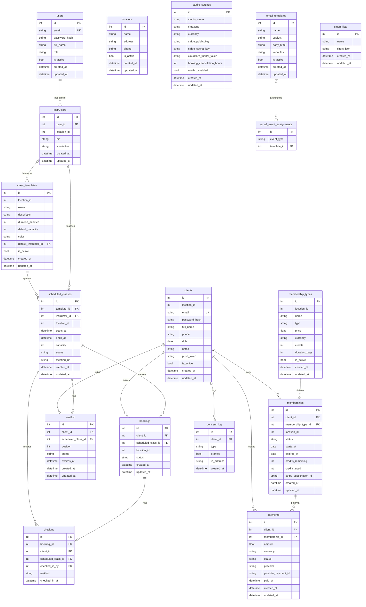

# Database Schema

Agon uses SQLite (WAL mode) as its local database. All datetime values are stored in UTC (timezone-naive).

## Entity Relationship Diagram

## Key Tables

| Table | Purpose |
|---|---|
| `users` | Studio manager and instructor accounts (login credentials) |
| `clients` | Gym members who book classes via the mobile app |
| `instructors` | One-to-one profile linked to a `users` row |
| `class_templates` | Reusable class definition (Yoga, HIIT, Pilates…) |
| `scheduled_classes` | A specific occurrence of a template at a date/time |
| `bookings` | A client's reservation for a scheduled class |
| `checkins` | Confirmed attendance record for a booking |
| `waitlist` | Queue entry when a class is full |
| `memberships` | A client's active subscription or credit pack |
| `membership_types` | Template for recurring plans or credit packs |
| `payments` | Payment records (Stripe or manual) |
| `locations` | Physical studio location (V1: always `id=1`) |
| `studio_settings` | Singleton row with studio configuration |
| `consent_log` | GDPR consent events |
| `email_templates` | Custom transactional email bodies |
| `email_event_assignments` | Maps lifecycle events to custom templates |
| `smart_lists` | Saved client filter queries for targeted messaging |

## Design Notes

### UTC-naive datetimes
All `DateTime` columns store UTC values **without timezone info**. The application layer always compares with `utcnow()` from `app.utils`. Never insert timezone-aware datetimes into the database.

### location_id convention
Every business entity carries `location_id` (default `1`). Location 1 (`Main Studio`) is seeded at migration time. This column is the hook for V2 multi-location support — no schema change needed.

### Soft delete vs hard delete
- **Soft delete** (status/is_active): clients, instructors, class templates, membership types, bookings, memberships, scheduled classes.
- **Hard delete**: Only on explicit GDPR erasure request. Personal data is anonymised in-place; booking/payment history rows are retained for audit purposes.

See [ARCHITECTURE.md](https://github.com/agon-studio/agon/blob/main/ARCHITECTURE.md) for the full delete strategy and cascade rules.

### Composite indexes
Performance-critical query patterns are covered by composite indexes:

| Index | Columns | Query pattern |
|---|---|---|
| `idx_booking_class_status` | `scheduled_class_id, status` | All confirmed bookings for a class |
| `idx_booking_client_status` | `client_id, status` | Client's booking history |
| `idx_membership_client_status` | `client_id, status` | Client's active membership lookup |
| `idx_class_starts_at_location_status` | `starts_at, location_id, status` | Calendar date-range queries |
